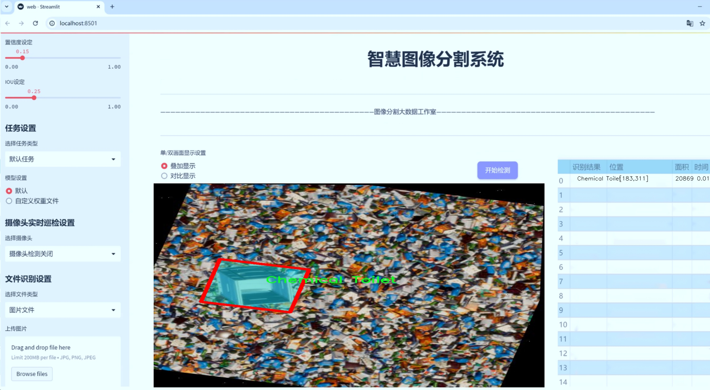
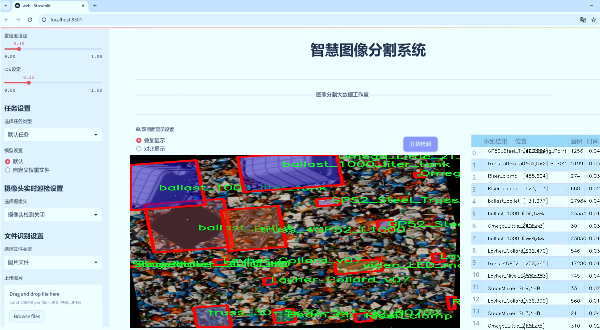
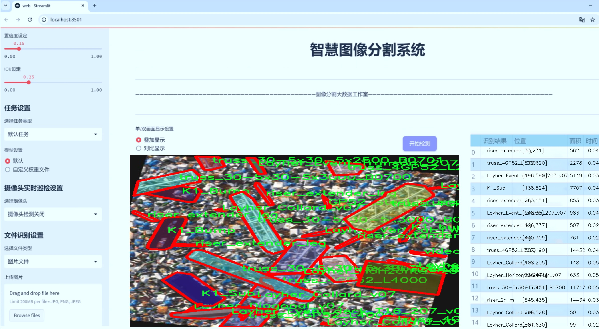
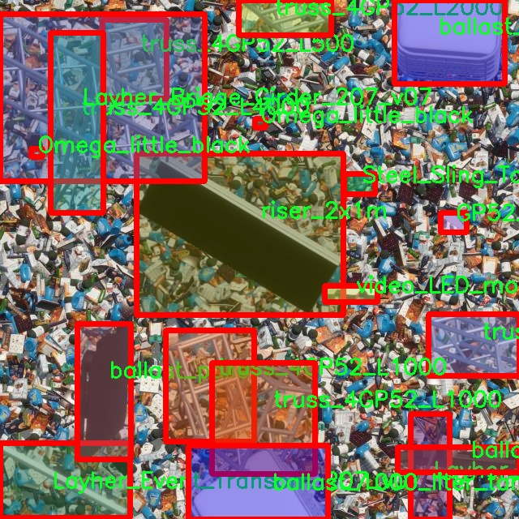
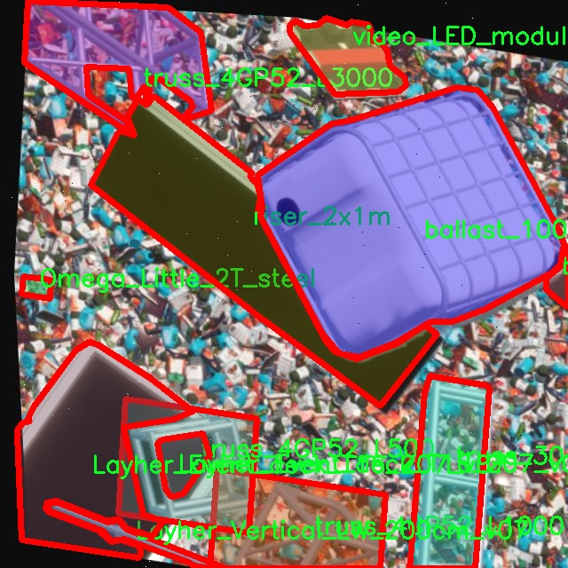
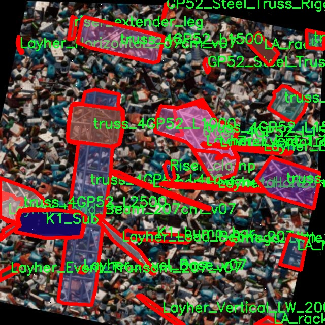
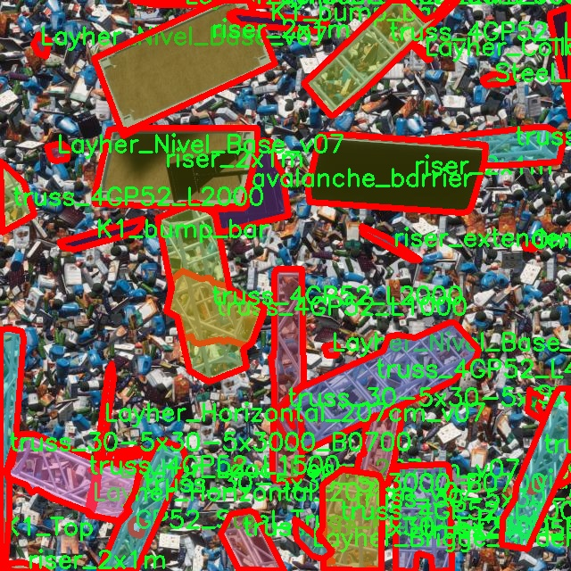
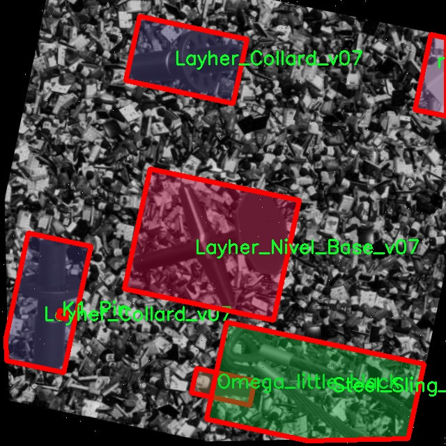

# 舞台设备分割系统源码＆数据集分享
 [yolov8-seg-KernelWarehouse＆yolov8-seg-EfficientHead等50+全套改进创新点发刊_一键训练教程_Web前端展示]

### 1.研究背景与意义

项目参考[ILSVRC ImageNet Large Scale Visual Recognition Challenge](https://gitee.com/YOLOv8_YOLOv11_Segmentation_Studio/projects)

项目来源[AAAI Global Al lnnovation Contest](https://kdocs.cn/l/cszuIiCKVNis)

研究背景与意义

随着舞台表演艺术的不断发展，舞台设备的复杂性和多样性日益增加。现代舞台设计不仅要求设备的功能性和安全性，还强调视觉效果和艺术表现力。在此背景下，如何高效、准确地识别和分割舞台设备，成为了提升舞台制作效率和安全性的重要课题。传统的舞台设备管理方法往往依赖人工检查和手动标记，不仅耗时耗力，而且容易出现误差，无法满足现代舞台制作对实时性和准确性的高要求。因此，基于计算机视觉的自动化设备分割系统应运而生，成为解决这一问题的有效途径。

本研究旨在基于改进的YOLOv8模型，构建一个高效的舞台设备分割系统。YOLO（You Only Look Once）系列模型因其快速的检测速度和较高的准确率，已成为目标检测领域的主流算法之一。YOLOv8作为该系列的最新版本，进一步优化了检测精度和实时性，特别适合于动态变化的舞台环境。通过对YOLOv8的改进，我们可以在保持高效检测的同时，提升对舞台设备的分割能力，从而实现对舞台设备的智能管理。

本研究所使用的数据集包含4400张图像，涵盖51类舞台设备，涉及从基本的舞台支架到复杂的LED视频屏幕等多种设备。这一丰富的数据集为模型的训练和测试提供了坚实的基础，使得模型能够在多样化的设备环境中进行有效的学习和识别。通过对不同类别设备的实例分割，系统不仅能够识别设备的存在，还能准确划分其边界，为后续的舞台设计和安全管理提供重要的数据支持。

此外，舞台设备的智能分割系统在实际应用中具有广泛的意义。首先，它能够大幅度提高舞台设备的管理效率，减少人工成本，降低人为错误的风险。其次，通过实时监控和分析舞台设备的状态，能够及时发现潜在的安全隐患，保障演出过程中的安全性。最后，随着舞台设备管理的智能化，能够为舞台设计师提供更为精准的数据支持，促进舞台艺术的创新与发展。

综上所述，基于改进YOLOv8的舞台设备分割系统的研究，不仅具有重要的学术价值，也在实际应用中展现出广阔的前景。通过本研究的开展，我们期望能够为舞台设备的智能管理提供新的思路和方法，推动舞台艺术与科技的深度融合。

### 2.图片演示







##### 注意：由于此博客编辑较早，上面“2.图片演示”和“3.视频演示”展示的系统图片或者视频可能为老版本，新版本在老版本的基础上升级如下：（实际效果以升级的新版本为准）

  （1）适配了YOLOV8的“目标检测”模型和“实例分割”模型，通过加载相应的权重（.pt）文件即可自适应加载模型。

  （2）支持“图片识别”、“视频识别”、“摄像头实时识别”三种识别模式。

  （3）支持“图片识别”、“视频识别”、“摄像头实时识别”三种识别结果保存导出，解决手动导出（容易卡顿出现爆内存）存在的问题，识别完自动保存结果并导出到tempDir中。

  （4）支持Web前端系统中的标题、背景图等自定义修改，后面提供修改教程。

  另外本项目提供训练的数据集和训练教程,暂不提供权重文件（best.pt）,需要您按照教程进行训练后实现图片演示和Web前端界面演示的效果。

### 3.视频演示

[3.1 视频演示](https://www.bilibili.com/video/BV1v72zYoEkc/)

### 4.数据集信息展示

##### 4.1 本项目数据集详细数据（类别数＆类别名）

nc: 51
names: ['Beam_Clamp_2T', 'Chemical Toilet', 'Complete Stack 8x K1 SB on wheels', 'Dressing_room_v2', 'GP52_Steel_Truss_Rigging_Point', 'K1 4xSB 16xTop Array', 'K1_Bump', 'K1_Pin', 'K1_Sub', 'K1_Top', 'K1_bump_bar', 'LA_rack', 'LA_rack_bump', 'LA_rack_dolly_board', 'LED Video Screen 6mx4m', 'Layher_Brigge_Girder_207_v07', 'Layher_Collard_v07', 'Layher_Diagonal_v07', 'Layher_Event_Transom_207_v07', 'Layher_Event_deck_T16_207_v07', 'Layher_Horizontal_207cm_v07', 'Layher_Load_Beam_207cm_v07', 'Layher_Nivel_Base_v07', 'Layher_Vertical_LW_200cm_spiga_v07', 'Layher_Vertical_LW_200cm_v07', 'Omega_Little_2T_steel', 'Omega_little_black', 'PowerPlant_400kva', 'Riser_clamp', 'StageMaker_SL10_HD', 'StageMaker_SL10_HU', 'Steel_Sling_Top', 'Trash bin', 'avalanche_barrier', 'ballast_1000_liter_tank', 'ballast_pallet', 'riser_2x1m', 'riser_extender_leg', 'riser_leg_60cm', 'truss_30-5x30-5x1000_B0703', 'truss_30-5x30-5x1500_B0702', 'truss_30-5x30-5x2500_B0701', 'truss_30-5x30-5x3000_B0700', 'truss_4GP52_L1000', 'truss_4GP52_L1500', 'truss_4GP52_L2000', 'truss_4GP52_L2500', 'truss_4GP52_L3000', 'truss_4GP52_L4000', 'truss_4GP52_L500', 'video_LED_module_0_5']


##### 4.2 本项目数据集信息介绍

数据集信息展示

在现代舞台设备管理与应用中，精确的设备分割与识别是确保演出安全与顺利进行的关键因素。为此，我们构建了一个名为“IS v01”的数据集，旨在为改进YOLOv8-seg的舞台设备分割系统提供丰富的训练数据。该数据集包含51个类别，涵盖了多种舞台设备，确保了模型在多样化场景下的有效性与鲁棒性。

“IS v01”数据集的类别设计充分考虑了舞台搭建与演出过程中常见的设备，具体类别包括但不限于：Beam_Clamp_2T、Chemical Toilet、Complete Stack 8x K1 SB on wheels、Dressing_room_v2等。这些类别的选择不仅反映了舞台设备的多样性，还体现了实际应用中的需求。例如，Chemical Toilet的存在是为了满足演出现场的基本卫生需求，而Dressing_room_v2则为演职人员提供了更为便利的更衣空间。

在数据集的构建过程中，我们确保每个类别的样本数量充足且质量高，以便于模型能够在训练中学习到每种设备的特征。比如，K1系列设备（如K1 4xSB 16xTop Array、K1_Bump、K1_Pin等）在现代舞台搭建中占据了重要地位，数据集中对这些设备的详细标注将极大提升模型的识别能力。此外，数据集中还包含了多种类型的支撑与连接设备，如truss系列（如truss_30-5x30-5x1000_B0703、truss_4GP52_L2000等），这些设备在舞台结构的稳定性与安全性方面发挥着不可或缺的作用。

数据集的设计不仅限于静态设备的识别，还考虑到了动态环境中的应用场景。例如，LED Video Screen 6mx4m的加入，反映了现代舞台对视觉效果的追求，同时也增加了模型在处理动态影像时的复杂性。此外，诸如PowerPlant_400kva等设备的存在，确保了舞台在电力供应方面的安全与稳定，这对于大型演出尤为重要。

通过对这些类别的精细划分与标注，“IS v01”数据集为YOLOv8-seg模型的训练提供了坚实的基础。我们相信，借助这一数据集，模型将能够在多种复杂场景中实现高效的设备分割与识别，进而提升舞台设备管理的智能化水平。未来，我们还计划持续扩展数据集的规模与类别，以适应不断变化的舞台技术与设备需求，推动舞台设备管理的进一步发展与创新。











### 5.全套项目环境部署视频教程（零基础手把手教学）

[5.1 环境部署教程链接（零基础手把手教学）](https://www.bilibili.com/video/BV1jG4Ve4E9t/?vd_source=bc9aec86d164b67a7004b996143742dc)


[5.2 安装Python虚拟环境创建和依赖库安装视频教程链接（零基础手把手教学）](https://www.bilibili.com/video/BV1nA4VeYEze/?vd_source=bc9aec86d164b67a7004b996143742dc)

### 6.手把手YOLOV8-seg训练视频教程（零基础小白有手就能学会）

[6.1 手把手YOLOV8-seg训练视频教程（零基础小白有手就能学会）](https://www.bilibili.com/video/BV1cA4VeYETe/?vd_source=bc9aec86d164b67a7004b996143742dc)


按照上面的训练视频教程链接加载项目提供的数据集，运行train.py即可开始训练



     Epoch   gpu_mem       box       obj       cls    labels  img_size
     1/200     0G   0.01576   0.01955  0.007536        22      1280: 100%|██████████| 849/849 [14:42<00:00,  1.04s/it]
               Class     Images     Labels          P          R     mAP@.5 mAP@.5:.95: 100%|██████████| 213/213 [01:14<00:00,  2.87it/s]
                 all       3395      17314      0.994      0.957      0.0957      0.0843

     Epoch   gpu_mem       box       obj       cls    labels  img_size
     2/200     0G   0.01578   0.01923  0.007006        22      1280: 100%|██████████| 849/849 [14:44<00:00,  1.04s/it]
               Class     Images     Labels          P          R     mAP@.5 mAP@.5:.95: 100%|██████████| 213/213 [01:12<00:00,  2.95it/s]
                 all       3395      17314      0.996      0.956      0.0957      0.0845

     Epoch   gpu_mem       box       obj       cls    labels  img_size
     3/200     0G   0.01561    0.0191  0.006895        27      1280: 100%|██████████| 849/849 [10:56<00:00,  1.29it/s]
               Class     Images     Labels          P          R     mAP@.5 mAP@.5:.95: 100%|███████   | 187/213 [00:52<00:00,  4.04it/s]
                 all       3395      17314      0.996      0.957      0.0957      0.0845


### 7.50+种全套YOLOV8-seg创新点代码加载调参视频教程（一键加载写好的改进模型的配置文件）

[7.1 50+种全套YOLOV8-seg创新点代码加载调参视频教程（一键加载写好的改进模型的配置文件）](https://www.bilibili.com/video/BV1Hw4VePEXv/?vd_source=bc9aec86d164b67a7004b996143742dc)

### 8.YOLOV8-seg图像分割算法原理

原始YOLOV8-seg算法原理

YOLO（You Only Look Once）系列算法自推出以来，凭借其高效的实时目标检测能力，迅速成为计算机视觉领域的热门选择。随着技术的不断演进，YOLOv8作为该系列的最新版本，不仅在检测精度和速度上取得了显著提升，还在特征分割任务中展现了其独特的优势。YOLOv8-seg算法正是基于YOLOv8架构进行改进，旨在实现更为精细的目标分割。

YOLOv8-seg算法的基本结构可以分为四个主要部分：输入层、Backbone骨干网络、Neck特征融合网络和Head检测模块。输入层负责对图像进行预处理，包括图像比例调整、Mosaic增强和瞄点计算等，以提高模型的鲁棒性和泛化能力。Mosaic增强技术通过将多张图像拼接在一起，生成新的训练样本，丰富了数据集，增强了模型对复杂场景的适应能力。

在Backbone部分，YOLOv8采用了C2f模块替代了传统的C3模块。C2f模块的设计灵感来源于YOLOv7的ELAN结构，旨在通过引入更多的分支和跨层连接，提升模型的梯度流动性。这种结构的优势在于能够更好地捕捉图像中的细节特征，从而提高特征表示能力。与此同时，YOLOv8还保留了SPPF（Spatial Pyramid Pooling Fusion）模块，通过不同内核尺寸的池化操作，对特征图进行有效的合并处理，进一步增强了特征的多样性和丰富性。

Neck部分则采用了双塔结构，即特征金字塔网络（FPN）与路径聚合网络（PAN）的结合。这种设计不仅促进了语义特征与定位特征之间的有效转移，还增强了对不同尺度目标的检测能力。特征金字塔网络通过多层次的特征融合，确保了在不同尺度下的目标都能被有效检测；而路径聚合网络则通过特征的上下文信息增强，进一步提升了模型的整体性能。

在Head模块中，YOLOv8-seg算法引入了解耦头结构，将分类和检测任务分开处理。这种结构的优势在于，分类任务更注重特征图中提取到的特征与已知类别之间的相似性，而定位任务则关注边界框与真实框之间的关系。通过这种解耦设计，模型的收敛速度和预测精度得到了显著提升。此外，YOLOv8-seg还采用了无锚框检测策略，直接预测目标的中心位置，减少了锚框的预测数量，从而加速了非最大抑制（NMS）过程，提高了检测效率。

YOLOv8-seg算法在损失计算方面也进行了优化，采用了Task-Aligned Assigner策略来分配正负样本。该策略通过综合考虑分类与回归的分数，选择最具代表性的正样本进行训练。损失计算涵盖了分类和回归两个分支，其中分类分支使用二元交叉熵损失（BCELoss），而回归分支则结合了分布焦点损失（DFLoss）和完全交并比损失（CIOULoss），以提高模型对边界框预测的准确性。

值得注意的是，YOLOv8-seg在处理图像时，对Mosaic数据增强的使用进行了优化。在训练的最后10个epoch中，停止使用Mosaic增强，以避免对数据真实分布的干扰，从而确保模型能够学习到更为真实的特征。这一改进有效提升了模型的泛化能力，使其在实际应用中表现得更加稳定。

综上所述，YOLOv8-seg算法通过对YOLOv8架构的多项改进，成功实现了高效的目标分割。其在特征提取、特征融合和损失计算等方面的创新设计，使得YOLOv8-seg不仅具备了快速的检测速度，还在精度上有了显著提升。这些特性使得YOLOv8-seg在各种实际应用场景中展现出强大的潜力，尤其是在需要实时处理和高精度分割的任务中，具有广泛的应用前景。随着YOLOv8-seg算法的不断发展与完善，未来有望在更多领域中发挥重要作用。


### 9.系统功能展示（检测对象为举例，实际内容以本项目数据集为准）

图9.1.系统支持检测结果表格显示

  图9.2.系统支持置信度和IOU阈值手动调节

  图9.3.系统支持自定义加载权重文件best.pt(需要你通过步骤5中训练获得)

  图9.4.系统支持摄像头实时识别

  图9.5.系统支持图片识别

  图9.6.系统支持视频识别

  图9.7.系统支持识别结果文件自动保存

  图9.8.系统支持Excel导出检测结果数据


### 10.50+种全套YOLOV8-seg创新点原理讲解（非科班也可以轻松写刊发刊，V11版本正在科研待更新）

#### 10.1 由于篇幅限制，每个创新点的具体原理讲解就不一一展开，具体见下列网址中的创新点对应子项目的技术原理博客网址【Blog】：


[10.1 50+种全套YOLOV8-seg创新点原理讲解链接](https://gitee.com/qunmasj/good)

#### 10.2 部分改进模块原理讲解(完整的改进原理见上图和技术博客链接)【如果此小节的图加载失败可以通过CSDN或者Github搜索该博客的标题访问原始博客，原始博客图片显示正常】
### 全维动态卷积ODConv
鉴于上述讨论，我们的ODConv引入了一种多维注意机制，该机制具有并行策略，用于学习卷积核在核空间的所有四个维度上的不同注意。图提供了CondConv、DyConv和ODConv的示意性比较。

ODConv的公式：根据等式1中的符号，ODConv可定义为


 将注意力标量分配给整个卷积核。图2示出了将这四种类型的关注乘以n个卷积核的过程。原则上，这四种类型的关注是相互补充的，并且以位置、信道、滤波器和核的顺序将它们逐步乘以卷积核 
 ，使得卷积运算不同w.r.t.所有空间位置、所有输入信道、所有滤波器和输入x的所有核，提供捕获丰富上下文线索的性能保证。因此，ODConv可以显著增强CNN基本卷积运算的特征提取能力。此外，具有单个卷积核的ODConv可以与标准CondConv和DyConv竞争或优于它们，为最终模型引入的额外参数大大减少。提供了大量实验来验证这些优点。通过比较等式1和等式2，我们可以清楚地看到，ODConv是一种更广义的动态卷积。此外，当设置n=1且 所有分量均为1时，只关注滤波器方向 的ODConv将减少为：将基于输入特征的SE变量应用于卷积滤波器，然后进行卷积运算（注意原始SE（Hu等人，2018b）基于输出特征，并且用于重新校准输出特征本身）。这种SE变体是ODConv的特例。


图：将ODConv中的四种注意类型逐步乘以卷积核的示例。（a） 沿空间维度的逐位置乘法运算，（b）沿输入信道维度的逐信道乘法运算、（c）沿输出信道维度的按滤波器乘法运算，以及（d）沿卷积核空间的核维度的按核乘法运算。方法部分对符号进行了说明
实现：对于ODConv，一个关键问题是如何计算卷积核的四种关注度 。继CondConv和DyConv之后，我们还使用SE型注意力模块（Hu等人，2018b），但将多个头部作为来计算它们，其结构如图所示。具体而言，首先通过逐通道全局平均池（GAP）运算将输入压缩到具有长度的特征向量中。随后，存在完全连接（FC）层和四个头部分支。ReLU（Krizhevsky等人，2012）位于FC层之后。FC层将压缩特征向量映射到具有缩减比的低维空间（根据消融实验，我们在所有主要实验中设置 ，避免了高模型复杂度）。对于四个头部分支，每个分支都有一个输出大小如图。

### 引入ODConv的改进YOLO
参考这篇博客涵盖了引入ODConv的改进YOLOv8系统的内容，ODConv采用多维注意机制，在卷积核空间的四个维度上学习不同的注意。结合了CondConv和DyConv的优势，ODConv通过图示的四种注意类型逐步与卷积核相乘，以捕获丰富的上下文线索，提升特征提取能力。

#### ODConv结构与方法
ODConv的公式和图示展示了其关注力分配给卷积核的方式，其中四种类型的关注以位置、信道、滤波器和核的顺序逐步与卷积核相乘。这种结构保证了卷积运算不同于标准的Conv操作，能够捕获更多上下文信息，从而增强了CNN的特征提取能力。另外，单个卷积核的ODConv在性能上能够与CondConv和DyConv相竞争，并且引入的额外参数大幅减少。

ODConv的特殊之处在于其广义的动态卷积性质，同时在特定条件下（n=1且所有分量为1），它可以退化为一种特例，即只关注滤波器方向，这类似于基于输入特征的SE变体，但不同于原始SE，它基于输出特征。

#### ODConv的实现
关键问题在于如何计算卷积核的四种关注度。ODConv采用了SE型注意力模块，结合了多个头部来计算这些关注度。具体实现上，通过逐通道全局平均池运算和完全连接层，将输入压缩为特征向量，随后使用四个头部分支来计算四种不同类型的关注。这样的结构能在保持模型复杂度可控的情况下，提升了特征的表征能力。

ODConv的引入为YOLOv8带来了显著的性能提升，并且通过大量实验证明了其在特征提取方面的优越性。其结合了多维注意机制和卷积操作，为目标检测和分拣系统的提升带来了新的思路和性能突破。


### 11.项目核心源码讲解（再也不用担心看不懂代码逻辑）

#### 11.1 ultralytics\utils\callbacks\dvc.py

以下是经过简化和注释的核心代码部分，主要保留了与DVCLive日志记录相关的功能。

```python
# 导入必要的库
from ultralytics.utils import LOGGER, SETTINGS, TESTS_RUNNING, checks
import os
import re
from pathlib import Path

# 尝试导入DVCLive并进行版本检查
try:
    assert not TESTS_RUNNING  # 确保不在测试运行中
    assert SETTINGS['dvc'] is True  # 确保集成已启用
    import dvclive
    assert checks.check_version('dvclive', '2.11.0', verbose=True)
    live = None  # DVCLive日志实例
    _processed_plots = {}  # 存储已处理的图表
    _training_epoch = False  # 标记当前是否为训练周期

except (ImportError, AssertionError, TypeError):
    dvclive = None  # 如果导入失败，则将dvclive设置为None

def _log_images(path, prefix=''):
    """记录指定路径的图像，使用可选前缀。"""
    if live:  # 如果DVCLive已初始化
        name = path.name
        # 根据批次分组图像，以便在UI中启用滑块
        m = re.search(r'_batch(\d+)', name)
        if m:
            ni = m[1]
            new_stem = re.sub(r'_batch(\d+)', '_batch', path.stem)
            name = (Path(new_stem) / ni).with_suffix(path.suffix)
        live.log_image(os.path.join(prefix, name), path)  # 记录图像

def _log_plots(plots, prefix=''):
    """记录训练进度的图像，如果之前未处理过。"""
    for name, params in plots.items():
        timestamp = params['timestamp']
        if _processed_plots.get(name) != timestamp:  # 检查是否已处理
            _log_images(name, prefix)  # 记录图像
            _processed_plots[name] = timestamp  # 更新已处理的图表时间戳

def on_pretrain_routine_start(trainer):
    """在预训练例程开始时初始化DVCLive日志记录。"""
    try:
        global live
        live = dvclive.Live(save_dvc_exp=True, cache_images=True)  # 初始化DVCLive
        LOGGER.info("DVCLive已检测到，自动记录已启用。")
    except Exception as e:
        LOGGER.warning(f'警告 ⚠️ DVCLive安装但未正确初始化，未记录此运行。{e}')

def on_train_start(trainer):
    """如果DVCLive日志记录处于活动状态，则记录训练参数。"""
    if live:
        live.log_params(trainer.args)  # 记录训练参数

def on_fit_epoch_end(trainer):
    """在每个训练周期结束时记录训练指标和模型信息。"""
    global _training_epoch
    if live and _training_epoch:  # 如果DVCLive已初始化且当前为训练周期
        all_metrics = {**trainer.label_loss_items(trainer.tloss, prefix='train'), **trainer.metrics, **trainer.lr}
        for metric, value in all_metrics.items():
            live.log_metric(metric, value)  # 记录每个指标

        _log_plots(trainer.plots, 'train')  # 记录训练图表
        live.next_step()  # 进入下一个步骤
        _training_epoch = False  # 重置训练周期标记

def on_train_end(trainer):
    """在训练结束时记录最佳指标、图表和混淆矩阵。"""
    if live:
        all_metrics = {**trainer.label_loss_items(trainer.tloss, prefix='train'), **trainer.metrics, **trainer.lr}
        for metric, value in all_metrics.items():
            live.log_metric(metric, value, plot=False)  # 记录最佳指标

        _log_plots(trainer.plots, 'val')  # 记录验证图表
        # 记录混淆矩阵
        if trainer.best.exists():
            live.log_artifact(trainer.best, copy=True, type='model')  # 记录最佳模型
        live.end()  # 结束日志记录

# 定义回调函数
callbacks = {
    'on_pretrain_routine_start': on_pretrain_routine_start,
    'on_train_start': on_train_start,
    'on_fit_epoch_end': on_fit_epoch_end,
    'on_train_end': on_train_end
} if dvclive else {}
```

### 代码注释说明：
1. **导入模块**：导入所需的库和模块，包括日志记录和路径处理。
2. **DVCLive初始化**：尝试导入DVCLive并进行版本检查，确保日志记录功能可用。
3. **图像和图表记录**：定义了记录图像和图表的函数，确保在训练过程中可以跟踪进度。
4. **训练过程中的回调**：定义了在训练开始、结束和每个周期结束时的回调函数，以记录训练参数和指标。

这个文件是Ultralytics YOLO项目中的一个回调模块，主要用于集成DVCLive库以记录训练过程中的各种信息。首先，文件导入了一些必要的模块和设置，包括日志记录器、设置参数和检查函数。接着，文件尝试导入DVCLive库，并进行一些基本的版本检查和条件判断，以确保在适当的环境下运行。

在文件中，定义了几个私有函数和一些回调函数，这些函数在训练的不同阶段被调用，以记录训练的状态和结果。首先，`_log_images`函数用于记录指定路径下的图像，并在UI中通过批次分组来实现滑动条的功能。`_log_plots`函数则用于记录训练过程中的图像，如果这些图像之前没有被处理过。`_log_confusion_matrix`函数用于记录混淆矩阵，帮助分析模型的分类性能。

接下来，文件定义了一系列的回调函数，例如`on_pretrain_routine_start`和`on_pretrain_routine_end`，分别在预训练开始和结束时被调用，用于初始化DVCLive记录器和记录训练过程中的图像。`on_train_start`函数在训练开始时记录训练参数，而`on_train_epoch_start`函数则在每个训练周期开始时设置一个全局变量，指示当前处于训练周期中。

`on_fit_epoch_end`函数在每个训练周期结束时被调用，记录训练指标和模型信息，并准备进入下一个步骤。最后，`on_train_end`函数在训练结束时记录最佳指标、图像和混淆矩阵，并结束DVCLive的记录。

最后，文件将这些回调函数组织成一个字典，方便在训练过程中调用。如果DVCLive未成功导入或初始化，则该字典将为空，确保程序的健壮性。总的来说，这个文件通过与DVCLive的集成，提供了一种有效的方式来监控和记录YOLO模型的训练过程。

#### 11.2 ui.py

```python
import sys
import subprocess

def run_script(script_path):
    """
    使用当前 Python 环境运行指定的脚本。

    Args:
        script_path (str): 要运行的脚本路径

    Returns:
        None
    """
    # 获取当前 Python 解释器的路径
    python_path = sys.executable

    # 构建运行命令，使用 streamlit 运行指定的脚本
    command = f'"{python_path}" -m streamlit run "{script_path}"'

    # 执行命令
    result = subprocess.run(command, shell=True)
    # 检查命令执行结果，如果返回码不为0，表示出错
    if result.returncode != 0:
        print("脚本运行出错。")

# 主程序入口
if __name__ == "__main__":
    # 指定要运行的脚本路径
    script_path = "web.py"  # 这里可以直接指定脚本名，假设在当前目录下

    # 调用函数运行脚本
    run_script(script_path)
```

### 代码核心部分说明：
1. **导入模块**：
   - `sys`：用于获取当前 Python 解释器的路径。
   - `subprocess`：用于执行外部命令。

2. **`run_script` 函数**：
   - 该函数接受一个脚本路径作为参数，并使用当前 Python 环境运行该脚本。
   - 使用 `sys.executable` 获取当前 Python 解释器的路径。
   - 构建一个命令字符串，使用 `streamlit` 模块运行指定的脚本。
   - 使用 `subprocess.run` 执行构建的命令，并检查返回码以判断脚本是否成功运行。

3. **主程序入口**：
   - 当脚本作为主程序运行时，指定要运行的脚本路径（这里假设为 `web.py`）。
   - 调用 `run_script` 函数执行指定的脚本。

这个程序文件名为 `ui.py`，主要功能是通过当前的 Python 环境运行一个指定的脚本，具体是使用 Streamlit 来启动一个 Web 应用。

程序首先导入了必要的模块，包括 `sys`、`os` 和 `subprocess`，以及一个自定义的 `abs_path` 函数，这个函数来自于 `QtFusion.path` 模块，可能用于获取文件的绝对路径。

接下来，定义了一个名为 `run_script` 的函数，该函数接受一个参数 `script_path`，表示要运行的脚本的路径。在函数内部，首先获取当前 Python 解释器的路径，存储在 `python_path` 变量中。然后，构建一个命令字符串，使用 Streamlit 运行指定的脚本。命令的格式是 `"{python_path}" -m streamlit run "{script_path}"`，其中 `{python_path}` 和 `{script_path}` 会被实际的路径替换。

使用 `subprocess.run` 方法执行构建好的命令，`shell=True` 参数允许在 shell 中执行命令。执行后，检查返回码 `result.returncode`，如果不等于 0，表示脚本运行出错，程序会打印出相应的错误信息。

在文件的最后部分，使用 `if __name__ == "__main__":` 来判断是否直接运行该脚本。如果是，则指定要运行的脚本路径为 `web.py`，并调用 `run_script` 函数来执行这个脚本。

总体来看，这个程序的作用是为一个 Streamlit 应用提供一个启动入口，确保在正确的 Python 环境中运行指定的 Web 应用脚本。

#### 11.3 ultralytics\utils\callbacks\raytune.py

以下是代码中最核心的部分，并附上详细的中文注释：

```python
# 导入必要的库和模块
from ultralytics.utils import SETTINGS

# 尝试导入Ray库并验证Ray Tune集成是否启用
try:
    assert SETTINGS['raytune'] is True  # 验证Ray Tune集成是否启用
    import ray
    from ray import tune
    from ray.air import session
except (ImportError, AssertionError):
    tune = None  # 如果导入失败或集成未启用，则将tune设置为None

def on_fit_epoch_end(trainer):
    """在每个训练周期结束时，将训练指标发送到Ray Tune。"""
    if ray.tune.is_session_enabled():  # 检查Ray Tune会话是否启用
        metrics = trainer.metrics  # 获取当前训练的指标
        metrics['epoch'] = trainer.epoch  # 将当前周期数添加到指标中
        session.report(metrics)  # 向Ray Tune报告当前的训练指标

# 定义回调函数，如果tune可用，则在训练结束时调用on_fit_epoch_end
callbacks = {
    'on_fit_epoch_end': on_fit_epoch_end, 
} if tune else {}
```

### 代码说明：
1. **导入模块**：首先导入了`SETTINGS`，用于检查Ray Tune的集成状态。
2. **异常处理**：通过`try-except`结构来导入Ray相关模块，并确保Ray Tune集成已启用。如果未启用或导入失败，则将`tune`设置为`None`。
3. **回调函数**：定义了`on_fit_epoch_end`函数，该函数在每个训练周期结束时被调用。它会检查Ray Tune会话是否启用，如果启用，则获取当前的训练指标并将其报告给Ray Tune。
4. **回调字典**：根据`tune`是否可用，定义一个回调字典`callbacks`，其中包含`on_fit_epoch_end`函数。这使得在训练过程中可以动态地使用Ray Tune进行指标监控。

这个程序文件是Ultralytics YOLO项目中的一个回调函数模块，主要用于与Ray Tune集成，以便在训练过程中进行超参数调优。首先，文件通过导入`SETTINGS`来检查Ray Tune集成是否启用。如果`SETTINGS['raytune']`为True，则尝试导入Ray库及其相关模块；如果导入失败或集成未启用，则将`tune`设置为None。

在这个模块中，定义了一个名为`on_fit_epoch_end`的函数，它会在每个训练周期结束时被调用。该函数的主要功能是将训练过程中的指标（metrics）发送到Ray Tune。具体来说，它首先检查Ray Tune的会话是否已启用，如果启用，则从训练器（trainer）中获取当前的指标，并将当前的训练周期（epoch）添加到指标中。最后，使用`session.report(metrics)`将这些指标报告给Ray Tune，以便进行后续的分析和调优。

最后，模块定义了一个`callbacks`字典，其中包含了`on_fit_epoch_end`回调函数，如果`tune`为None，则该字典为空。这种设计使得在不需要Ray Tune的情况下，代码仍然可以正常运行，而不会引发错误。整体来看，这个文件的目的是为Ultralytics YOLO的训练过程提供与Ray Tune的集成支持，以便更好地进行模型的超参数优化。

#### 11.4 ultralytics\models\sam\modules\encoders.py

以下是代码中最核心的部分，并附上详细的中文注释：

```python
import torch
import torch.nn as nn
import torch.nn.functional as F

class ImageEncoderViT(nn.Module):
    """
    使用视觉变换器（ViT）架构的图像编码器，将图像编码为紧凑的潜在空间。
    编码器将图像分割为补丁，并通过一系列变换块处理这些补丁。
    最终的编码表示通过一个颈部模块生成。
    """

    def __init__(self, img_size: int = 1024, patch_size: int = 16, in_chans: int = 3, embed_dim: int = 768, depth: int = 12, out_chans: int = 256):
        """
        初始化图像编码器的参数。

        Args:
            img_size (int): 输入图像的大小。
            patch_size (int): 每个补丁的大小。
            in_chans (int): 输入图像的通道数。
            embed_dim (int): 补丁嵌入的维度。
            depth (int): ViT的深度（变换块的数量）。
            out_chans (int): 输出通道数。
        """
        super().__init__()
        self.img_size = img_size

        # 初始化补丁嵌入模块
        self.patch_embed = PatchEmbed(
            kernel_size=(patch_size, patch_size),
            stride=(patch_size, patch_size),
            in_chans=in_chans,
            embed_dim=embed_dim,
        )

        # 初始化变换块
        self.blocks = nn.ModuleList()
        for _ in range(depth):
            block = Block(dim=embed_dim)
            self.blocks.append(block)

        # 颈部模块，用于进一步处理输出
        self.neck = nn.Sequential(
            nn.Conv2d(embed_dim, out_chans, kernel_size=1, bias=False),
            nn.LayerNorm(out_chans),
            nn.Conv2d(out_chans, out_chans, kernel_size=3, padding=1, bias=False),
            nn.LayerNorm(out_chans),
        )

    def forward(self, x: torch.Tensor) -> torch.Tensor:
        """通过补丁嵌入、变换块和颈部模块处理输入。"""
        x = self.patch_embed(x)  # 将输入图像分割为补丁并嵌入
        for blk in self.blocks:  # 通过每个变换块
            x = blk(x)
        return self.neck(x.permute(0, 3, 1, 2))  # 调整维度并通过颈部模块

class Block(nn.Module):
    """变换块，包含多头注意力和前馈网络。"""

    def __init__(self, dim: int):
        """
        初始化变换块的参数。

        Args:
            dim (int): 输入通道数。
        """
        super().__init__()
        self.norm1 = nn.LayerNorm(dim)  # 归一化层
        self.attn = Attention(dim)  # 注意力机制
        self.norm2 = nn.LayerNorm(dim)  # 归一化层
        self.mlp = MLPBlock(embedding_dim=dim)  # 前馈网络

    def forward(self, x: torch.Tensor) -> torch.Tensor:
        """执行变换块的前向传播。"""
        shortcut = x  # 残差连接
        x = self.norm1(x)  # 归一化
        x = self.attn(x)  # 注意力机制
        x = shortcut + x  # 残差连接
        return x + self.mlp(self.norm2(x))  # 通过前馈网络并返回

class Attention(nn.Module):
    """多头注意力模块。"""

    def __init__(self, dim: int):
        """
        初始化注意力模块的参数。

        Args:
            dim (int): 输入通道数。
        """
        super().__init__()
        self.qkv = nn.Linear(dim, dim * 3)  # 查询、键、值的线性变换
        self.proj = nn.Linear(dim, dim)  # 输出的线性变换

    def forward(self, x: torch.Tensor) -> torch.Tensor:
        """执行注意力机制的前向传播。"""
        B, H, W, _ = x.shape  # 获取输入的形状
        qkv = self.qkv(x).reshape(B, H * W, 3, -1).permute(2, 0, 3, 1)  # 计算qkv
        q, k, v = qkv.unbind(0)  # 分离q、k、v
        attn = (q @ k.transpose(-2, -1)) * (q.size(-1) ** -0.5)  # 计算注意力权重
        attn = attn.softmax(dim=-1)  # 归一化
        x = (attn @ v).view(B, H, W, -1)  # 计算输出
        return self.proj(x)  # 通过线性变换输出

class PatchEmbed(nn.Module):
    """图像到补丁嵌入的模块。"""

    def __init__(self, kernel_size: Tuple[int, int] = (16, 16), in_chans: int = 3, embed_dim: int = 768):
        """
        初始化补丁嵌入模块。

        Args:
            kernel_size (Tuple): 卷积核大小。
            in_chans (int): 输入图像的通道数。
            embed_dim (int): 补丁嵌入的维度。
        """
        super().__init__()
        self.proj = nn.Conv2d(in_chans, embed_dim, kernel_size=kernel_size)  # 卷积层用于补丁嵌入

    def forward(self, x: torch.Tensor) -> torch.Tensor:
        """计算补丁嵌入。"""
        return self.proj(x).permute(0, 2, 3, 1)  # 将输出维度调整为[B, H, W, C]
```

### 代码核心部分说明：
1. **ImageEncoderViT**：图像编码器，使用ViT架构将图像编码为潜在空间。包含补丁嵌入、变换块和颈部模块。
2. **Block**：变换块，包含多头注意力机制和前馈网络，支持残差连接。
3. **Attention**：多头注意力模块，计算查询、键、值的线性变换并计算注意力权重。
4. **PatchEmbed**：将输入图像分割为补丁并进行嵌入的模块，使用卷积层实现。

这些核心部分共同构成了一个基于ViT的图像编码器的基础结构。

这个程序文件定义了一个图像编码器和一个提示编码器，主要用于图像处理和深度学习模型中的特征提取。文件中包含多个类，每个类都有其特定的功能。

首先，`ImageEncoderViT`类实现了一个基于视觉变换器（ViT）架构的图像编码器。该编码器的主要任务是将输入图像编码为一个紧凑的潜在空间表示。它通过将图像分割成多个小块（patches），并通过一系列的变换块（transformer blocks）处理这些小块来实现。该类的构造函数中定义了多个参数，包括输入图像的大小、补丁的大小、嵌入维度、变换块的深度、注意力头的数量等。编码器还包括一个“neck”模块，用于进一步处理输出。

在`forward`方法中，输入图像首先通过补丁嵌入模块进行处理，如果存在位置嵌入，则将其添加到输出中。接着，输出经过所有的变换块，最后通过neck模块生成最终的编码表示。

接下来是`PromptEncoder`类，它用于编码不同类型的提示信息，包括点、框和掩码。这些提示信息用于输入到SAM（Segment Anything Model）的掩码解码器中。该类生成稀疏和密集的嵌入表示。构造函数中定义了嵌入维度、输入图像大小、掩码输入通道数等参数，并初始化了多个嵌入模块。

`forward`方法负责处理输入的点、框和掩码，返回稀疏和密集的嵌入表示。它首先获取批量大小，然后根据输入的提示类型调用相应的嵌入方法，最后返回生成的嵌入。

`PositionEmbeddingRandom`类用于生成随机空间频率的位置信息编码。它的构造函数中初始化了一个高斯矩阵，用于生成位置编码。`forward`方法根据指定的大小生成位置编码。

`Block`类实现了变换器块，支持窗口注意力和残差传播。它的构造函数中定义了多个参数，包括输入通道数、注意力头的数量、MLP比率等。`forward`方法执行前向传播，计算注意力和MLP的输出。

`Attention`类实现了多头注意力机制，支持相对位置嵌入。它的构造函数中定义了输入通道数、注意力头的数量等参数。`forward`方法计算注意力分数并应用到输入上。

此外，文件中还定义了一些辅助函数，如`window_partition`和`window_unpartition`，用于将输入张量划分为窗口和恢复原始形状，以及`get_rel_pos`和`add_decomposed_rel_pos`，用于处理相对位置嵌入。

最后，`PatchEmbed`类实现了图像到补丁嵌入的转换，通过卷积操作将输入图像转换为补丁嵌入表示。

整体来看，这个程序文件通过定义多个类和方法，实现了一个功能强大的图像编码器和提示编码器，能够有效地处理图像数据并提取特征。

#### 11.5 ultralytics\engine\validator.py

以下是经过简化并添加详细中文注释的核心代码部分：

```python
import json
import time
from pathlib import Path
import numpy as np
import torch
from ultralytics.cfg import get_cfg, get_save_dir
from ultralytics.nn.autobackend import AutoBackend
from ultralytics.utils import LOGGER, TQDM, callbacks
from ultralytics.utils.checks import check_imgsz
from ultralytics.utils.ops import Profile
from ultralytics.utils.torch_utils import select_device, smart_inference_mode

class BaseValidator:
    """
    BaseValidator 类用于创建验证器的基类。

    属性:
        args: 验证器的配置参数。
        dataloader: 用于验证的数据加载器。
        model: 要验证的模型。
        device: 用于验证的设备。
        speed: 记录处理速度的字典。
        save_dir: 保存结果的目录。
    """

    def __init__(self, dataloader=None, save_dir=None, args=None):
        """
        初始化 BaseValidator 实例。

        参数:
            dataloader: 用于验证的数据加载器。
            save_dir: 保存结果的目录。
            args: 验证器的配置参数。
        """
        self.args = get_cfg(overrides=args)  # 获取配置
        self.dataloader = dataloader  # 数据加载器
        self.model = None  # 模型初始化
        self.device = None  # 设备初始化
        self.save_dir = save_dir or get_save_dir(self.args)  # 保存目录
        self.speed = {'preprocess': 0.0, 'inference': 0.0, 'loss': 0.0, 'postprocess': 0.0}  # 速度记录

    @smart_inference_mode()
    def __call__(self, model=None):
        """
        支持验证预训练模型或正在训练的模型。
        """
        model = AutoBackend(model or self.args.model, device=select_device(self.args.device))  # 初始化模型
        self.device = model.device  # 更新设备
        self.dataloader = self.dataloader or self.get_dataloader(self.args.data, self.args.batch)  # 获取数据加载器

        # 进行验证过程
        for batch_i, batch in enumerate(TQDM(self.dataloader)):
            # 预处理
            batch = self.preprocess(batch)

            # 推理
            preds = model(batch['img'])

            # 更新指标
            self.update_metrics(preds, batch)

        stats = self.get_stats()  # 获取统计信息
        self.print_results()  # 打印结果
        return stats  # 返回统计信息

    def preprocess(self, batch):
        """预处理输入批次数据。"""
        return batch  # 返回处理后的批次数据

    def update_metrics(self, preds, batch):
        """根据预测结果和批次数据更新指标。"""
        pass  # 更新指标的具体实现

    def get_stats(self):
        """返回模型性能的统计信息。"""
        return {}  # 返回空字典，实际实现中应返回统计信息

    def print_results(self):
        """打印模型预测的结果。"""
        pass  # 打印结果的具体实现

    def get_dataloader(self, dataset_path, batch_size):
        """根据数据集路径和批量大小获取数据加载器。"""
        raise NotImplementedError('get_dataloader function not implemented for this validator')  # 抛出未实现异常
```

### 代码注释说明：
1. **类定义**：`BaseValidator` 类是验证器的基类，负责处理模型验证的核心逻辑。
2. **初始化方法**：`__init__` 方法用于初始化验证器的配置、数据加载器、模型和设备等。
3. **调用方法**：`__call__` 方法是验证的主要入口，支持对预训练模型或正在训练的模型进行验证。
4. **预处理方法**：`preprocess` 方法用于对输入批次数据进行预处理，具体实现可以根据需求扩展。
5. **更新指标方法**：`update_metrics` 方法用于根据模型的预测结果和实际批次数据更新性能指标，具体实现待完善。
6. **获取统计信息**：`get_stats` 方法返回模型性能的统计信息，当前实现返回空字典。
7. **打印结果**：`print_results` 方法用于打印模型的预测结果，具体实现待完善。
8. **获取数据加载器**：`get_dataloader` 方法用于根据数据集路径和批量大小获取数据加载器，当前实现抛出未实现异常。

这些核心部分和注释提供了代码的基本结构和功能概述，便于理解和扩展。

这个程序文件 `ultralytics/engine/validator.py` 是一个用于验证 YOLO 模型准确性的基类，主要用于在数据集的测试或验证分割上评估模型的性能。该文件包含了一个名为 `BaseValidator` 的类，该类负责处理模型验证的各个步骤，包括数据加载、模型推理、损失计算、结果统计等。

在文件开头，提供了使用该验证器的示例命令，说明可以使用不同格式的模型文件进行验证，包括 PyTorch、ONNX、TensorRT 等格式。接下来，文件导入了一些必要的库和模块，包括 JSON 处理、时间管理、路径操作、NumPy 和 PyTorch。

`BaseValidator` 类的构造函数初始化了一些重要的属性，例如数据加载器、保存结果的目录、进度条、模型配置等。构造函数还会检查输入图像的尺寸，并创建保存结果的目录。

该类的核心功能通过 `__call__` 方法实现，该方法支持对预训练模型或正在训练的模型进行验证。根据传入的参数，方法会选择合适的设备（如 CPU 或 GPU），并根据模型类型加载相应的模型。接着，它会检查数据集的有效性，并创建数据加载器。

在验证过程中，程序会记录每个批次的处理时间，并更新性能指标。它还会在每个批次结束时运行回调函数，以便在验证过程中执行自定义操作。最终，验证结果会被打印出来，并根据需要保存为 JSON 格式。

`BaseValidator` 类还定义了一些辅助方法，例如 `match_predictions` 用于将预测结果与真实标签进行匹配，`add_callback` 和 `run_callbacks` 用于管理回调函数，`get_dataloader` 和 `build_dataset` 用于数据加载（这两个方法需要在子类中实现）。

此外，还有一些方法用于预处理和后处理数据，初始化和更新性能指标，以及获取和检查统计信息。这些方法的具体实现通常会在子类中定义，以适应不同的验证需求。

总体而言，这个文件为 YOLO 模型的验证提供了一个灵活的框架，允许用户根据不同的需求进行扩展和定制。

#### 11.6 train.py

以下是代码中最核心的部分，并附上详细的中文注释：

```python
import os
import torch
import yaml
from ultralytics import YOLO  # 导入YOLO模型库

if __name__ == '__main__':  # 确保该模块被直接运行时才执行以下代码
    # 设置训练参数
    workers = 1  # 数据加载的工作进程数
    batch = 8  # 每个批次的样本数量，需根据显存/内存调整
    device = "0" if torch.cuda.is_available() else "cpu"  # 判断是否使用GPU

    # 获取数据集配置文件的绝对路径
    data_path = abs_path(f'datasets/data/data.yaml', path_type='current')

    # 将路径格式转换为Unix风格
    unix_style_path = data_path.replace(os.sep, '/')
    # 获取目录路径
    directory_path = os.path.dirname(unix_style_path)

    # 读取YAML文件，保持原有顺序
    with open(data_path, 'r') as file:
        data = yaml.load(file, Loader=yaml.FullLoader)

    # 修改数据集路径
    if 'train' in data and 'val' in data and 'test' in data:
        data['train'] = directory_path + '/train'  # 设置训练集路径
        data['val'] = directory_path + '/val'      # 设置验证集路径
        data['test'] = directory_path + '/test'    # 设置测试集路径

        # 将修改后的数据写回YAML文件
        with open(data_path, 'w') as file:
            yaml.safe_dump(data, file, sort_keys=False)

    # 加载YOLO模型配置和预训练权重
    model = YOLO(r"C:\codeseg\codenew\50+种YOLOv8算法改进源码大全和调试加载训练教程（非必要）\改进YOLOv8模型配置文件\yolov8-seg-C2f-Faster.yaml").load("./weights/yolov8s-seg.pt")

    # 开始训练模型
    results = model.train(
        data=data_path,  # 指定训练数据的配置文件路径
        device=device,  # 指定使用的设备（GPU或CPU）
        workers=workers,  # 指定数据加载的工作进程数
        imgsz=640,  # 输入图像的大小
        epochs=100,  # 训练的轮数
        batch=batch,  # 每个批次的样本数量
    )
```

### 代码注释说明：
1. **导入库**：导入必要的库，包括操作系统库、PyTorch、YAML解析库和YOLO模型库。
2. **主程序入口**：使用`if __name__ == '__main__':`确保只有在直接运行该脚本时才执行以下代码。
3. **训练参数设置**：设置数据加载的工作进程数、批次大小和设备类型（GPU或CPU）。
4. **数据集路径处理**：获取数据集配置文件的绝对路径，并将其转换为Unix风格路径，方便后续处理。
5. **读取和修改YAML文件**：读取YAML文件，修改训练、验证和测试集的路径，并将修改后的内容写回文件。
6. **加载YOLO模型**：根据指定的配置文件和预训练权重加载YOLO模型。
7. **模型训练**：调用模型的`train`方法开始训练，传入数据路径、设备、工作进程数、图像大小、训练轮数和批次大小等参数。

该程序文件`train.py`的主要功能是使用YOLO（You Only Look Once）模型进行目标检测的训练。程序首先导入了必要的库，包括操作系统相关的`os`、深度学习框架`torch`、YAML文件处理库`yaml`、YOLO模型的库`ultralytics`以及用于图形界面的`matplotlib`。

在程序的主入口部分，首先设置了一些训练参数，包括工作进程数`workers`、批次大小`batch`和设备类型`device`。设备类型的选择是基于当前系统是否支持CUDA，如果支持则使用GPU（设备编号为"0"），否则使用CPU。

接下来，程序通过`abs_path`函数获取数据集配置文件`data.yaml`的绝对路径，并将其转换为Unix风格的路径。然后，程序读取该YAML文件，解析其中的数据，并获取数据集的目录路径。特别地，程序检查YAML文件中是否包含`train`、`val`和`test`字段，如果存在，则将这些字段的路径修改为相对于数据集目录的路径，并将修改后的内容写回到YAML文件中。

程序中还提到，不同的YOLO模型对设备的要求不同，如果当前模型出现错误，可以尝试其他模型进行测试。接着，程序加载了一个YOLOv8模型的配置文件，并加载了预训练的权重文件。

最后，程序调用`model.train()`方法开始训练模型，传入了训练数据的配置文件路径、设备类型、工作进程数、输入图像大小、训练的epoch数量以及批次大小等参数。通过这些设置，程序能够有效地进行目标检测模型的训练。

### 12.系统整体结构（节选）

### 整体功能和构架概括

Ultralytics YOLO项目是一个用于目标检测的深度学习框架，主要实现了YOLO系列模型的训练、验证和推理。该项目的整体架构包括多个模块和文件，每个文件负责特定的功能，以便于实现模型的训练、验证、推理和可视化等任务。

- **训练模块** (`train.py`): 负责设置训练参数、加载数据集、配置模型并启动训练过程。
- **验证模块** (`validator.py`): 提供验证模型性能的框架，支持在验证集上评估模型的准确性。
- **回调模块** (`callbacks`): 包含多个回调函数，用于在训练和验证过程中记录信息、处理结果和集成其他工具（如DVCLive和Ray Tune）。
- **模型模块** (`models`): 包含模型架构的定义，包括编码器、解码器和不同的YOLO模型变体。
- **用户界面模块** (`ui.py`): 提供一个启动Streamlit应用的入口，便于可视化和交互。
- **日志模块** (`log.py`): 负责记录训练和验证过程中的信息，便于后续分析。

### 文件功能整理表

| 文件路径                                               | 功能描述                                                     |
|------------------------------------------------------|------------------------------------------------------------|
| `ultralytics/utils/callbacks/dvc.py`                | 集成DVCLive库，记录训练过程中的指标和图像。                      |
| `ui.py`                                             | 启动Streamlit Web应用，提供可视化和交互界面。                     |
| `ultralytics/utils/callbacks/raytune.py`            | 集成Ray Tune库，支持超参数调优并记录训练过程中的指标。             |
| `ultralytics/models/sam/modules/encoders.py`        | 定义图像编码器和提示编码器，用于特征提取和处理输入提示。             |
| `ultralytics/engine/validator.py`                   | 提供模型验证的框架，评估模型在验证集上的性能。                      |
| `train.py`                                          | 设置训练参数，加载数据集，配置模型并启动训练过程。                 |
| `ultralytics/models/yolo/detect/predict.py`         | 实现YOLO模型的推理功能，进行目标检测。                             |
| `ultralytics/nn/tasks.py`                           | 定义训练和推理任务的管理和调度。                                 |
| `ultralytics/nn/backbone/SwinTransformer.py`        | 实现Swin Transformer模型的定义和功能。                           |
| `log.py`                                            | 记录训练和验证过程中的日志信息，便于后续分析。                     |
| `ultralytics/models/yolo/__init__.py`               | 初始化YOLO模型模块，可能包含模型的导入和配置。                     |
| `ultralytics/models/yolo/pose/train.py`             | 处理YOLO模型在姿态估计任务中的训练过程。                           |
| `ultralytics/nn/backbone/convnextv2.py`             | 实现ConvNeXt V2模型的定义和功能。                               |

以上表格总结了每个文件的主要功能，展示了Ultralytics YOLO项目的模块化设计，使得各个功能可以独立开发和维护，同时也便于用户进行扩展和定制。

注意：由于此博客编辑较早，上面“11.项目核心源码讲解（再也不用担心看不懂代码逻辑）”中部分代码可能会优化升级，仅供参考学习，完整“训练源码”、“Web前端界面”和“50+种创新点源码”以“14.完整训练+Web前端界面+50+种创新点源码、数据集获取”的内容为准。

### 13.图片、视频、摄像头图像分割Demo(去除WebUI)代码

在这个博客小节中，我们将讨论如何在不使用WebUI的情况下，实现图像分割模型的使用。本项目代码已经优化整合，方便用户将分割功能嵌入自己的项目中。
核心功能包括图片、视频、摄像头图像的分割，ROI区域的轮廓提取、类别分类、周长计算、面积计算、圆度计算以及颜色提取等。
这些功能提供了良好的二次开发基础。

### 核心代码解读

以下是主要代码片段，我们会为每一块代码进行详细的批注解释：

```python
import random
import cv2
import numpy as np
from PIL import ImageFont, ImageDraw, Image
from hashlib import md5
from model import Web_Detector
from chinese_name_list import Label_list

# 根据名称生成颜色
def generate_color_based_on_name(name):
    ......

# 计算多边形面积
def calculate_polygon_area(points):
    return cv2.contourArea(points.astype(np.float32))

...
# 绘制中文标签
def draw_with_chinese(image, text, position, font_size=20, color=(255, 0, 0)):
    image_pil = Image.fromarray(cv2.cvtColor(image, cv2.COLOR_BGR2RGB))
    draw = ImageDraw.Draw(image_pil)
    font = ImageFont.truetype("simsun.ttc", font_size, encoding="unic")
    draw.text(position, text, font=font, fill=color)
    return cv2.cvtColor(np.array(image_pil), cv2.COLOR_RGB2BGR)

# 动态调整参数
def adjust_parameter(image_size, base_size=1000):
    max_size = max(image_size)
    return max_size / base_size

# 绘制检测结果
def draw_detections(image, info, alpha=0.2):
    name, bbox, conf, cls_id, mask = info['class_name'], info['bbox'], info['score'], info['class_id'], info['mask']
    adjust_param = adjust_parameter(image.shape[:2])
    spacing = int(20 * adjust_param)

    if mask is None:
        x1, y1, x2, y2 = bbox
        aim_frame_area = (x2 - x1) * (y2 - y1)
        cv2.rectangle(image, (x1, y1), (x2, y2), color=(0, 0, 255), thickness=int(3 * adjust_param))
        image = draw_with_chinese(image, name, (x1, y1 - int(30 * adjust_param)), font_size=int(35 * adjust_param))
        y_offset = int(50 * adjust_param)  # 类别名称上方绘制，其下方留出空间
    else:
        mask_points = np.concatenate(mask)
        aim_frame_area = calculate_polygon_area(mask_points)
        mask_color = generate_color_based_on_name(name)
        try:
            overlay = image.copy()
            cv2.fillPoly(overlay, [mask_points.astype(np.int32)], mask_color)
            image = cv2.addWeighted(overlay, 0.3, image, 0.7, 0)
            cv2.drawContours(image, [mask_points.astype(np.int32)], -1, (0, 0, 255), thickness=int(8 * adjust_param))

            # 计算面积、周长、圆度
            area = cv2.contourArea(mask_points.astype(np.int32))
            perimeter = cv2.arcLength(mask_points.astype(np.int32), True)
            ......

            # 计算色彩
            mask = np.zeros(image.shape[:2], dtype=np.uint8)
            cv2.drawContours(mask, [mask_points.astype(np.int32)], -1, 255, -1)
            color_points = cv2.findNonZero(mask)
            ......

            # 绘制类别名称
            x, y = np.min(mask_points, axis=0).astype(int)
            image = draw_with_chinese(image, name, (x, y - int(30 * adjust_param)), font_size=int(35 * adjust_param))
            y_offset = int(50 * adjust_param)

            # 绘制面积、周长、圆度和色彩值
            metrics = [("Area", area), ("Perimeter", perimeter), ("Circularity", circularity), ("Color", color_str)]
            for idx, (metric_name, metric_value) in enumerate(metrics):
                ......

    return image, aim_frame_area

# 处理每帧图像
def process_frame(model, image):
    pre_img = model.preprocess(image)
    pred = model.predict(pre_img)
    det = pred[0] if det is not None and len(det)
    if det:
        det_info = model.postprocess(pred)
        for info in det_info:
            image, _ = draw_detections(image, info)
    return image

if __name__ == "__main__":
    cls_name = Label_list
    model = Web_Detector()
    model.load_model("./weights/yolov8s-seg.pt")

    # 摄像头实时处理
    cap = cv2.VideoCapture(0)
    while cap.isOpened():
        ret, frame = cap.read()
        if not ret:
            break
        ......

    # 图片处理
    image_path = './icon/OIP.jpg'
    image = cv2.imread(image_path)
    if image is not None:
        processed_image = process_frame(model, image)
        ......

    # 视频处理
    video_path = ''  # 输入视频的路径
    cap = cv2.VideoCapture(video_path)
    while cap.isOpened():
        ret, frame = cap.read()
        ......
```


### 14.完整训练+Web前端界面+50+种创新点源码、数据集获取


# [下载链接：https://mbd.pub/o/bread/Zp2TmZdy](https://mbd.pub/o/bread/Zp2TmZdy)